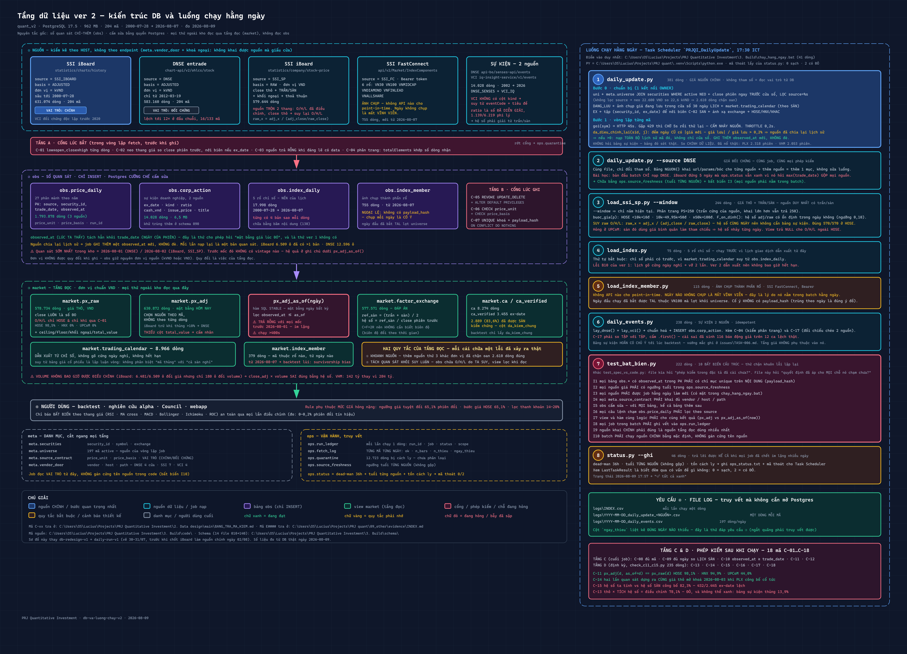
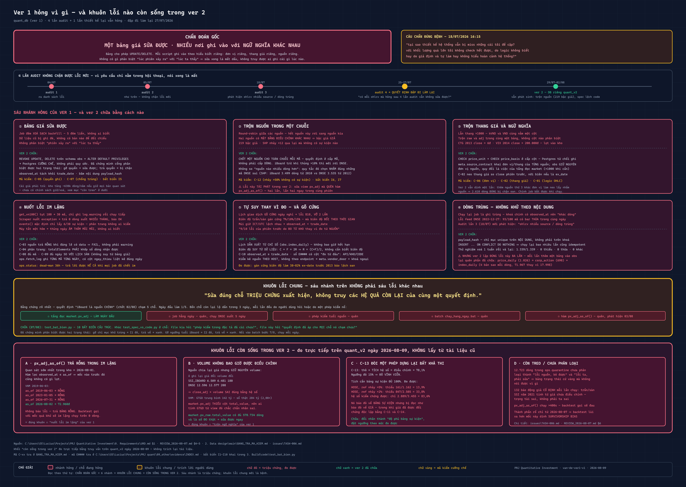

# PRJ Quantitative Investment — sơ đồ tầng dữ liệu

Repo này **chỉ để xem và theo dõi sơ đồ**. Không có code, không liên kết với repo chính.

📄 **Trang xem có phóng to / kéo thả: https://vn-quant.github.io/prj-qi-diagrams/**

| | |
|---|---|
| Bản gốc của sơ đồ | `PRJ Quantitative Investment\2. Data design\main\diagram\` (repo chính, private) |
| Cách cập nhật | sửa `.svg` ở repo chính → render lại `@2x.png` → copy sang đây → commit |
| Số liệu trên sơ đồ | đo trực tiếp từ DB `quant_v2` ngày **2026-08-09** |

---

## ① Kiến trúc DB & luồng chạy hằng ngày

`db-va-luong-chay-v2` · 2026-08-09

Cột trái là bốn tầng dữ liệu — **nguồn → `obs` → `market` → người dùng**, với `meta` và `ops`
cắt ngang. Cột phải là **8 bước của job 17:30**, mỗi bước ghi rõ tên file code, số dòng, và
logic bên trong.

Ba chỗ được đánh dấu đỏ vì là bẫy đã sập thật, không phải rủi ro lý thuyết:

- `market.px_adj_as_of()` trả **rỗng trong im lặng** với mọi mốc trước 2026-08-01
- **volume không bao giờ được điều chỉnh** → `close_adj × volume` sai đúng bằng hệ số điều chỉnh
- **C-13** báo đỏ vĩnh viễn: nó đòi tích hệ số đầy đủ, mà bảng sự kiện thủng 13,9%

---

## ② Ver 1 hỏng vì gì — và khuôn lỗi nào còn sống trong ver 2

`van-de-ver1-v1` · 2026-08-09

Đọc từ trên xuống: **chẩn đoán gốc → 4 lần audit → 6 nhánh hỏng → khuôn lỗi chung →
4 khuôn còn sống trong ver 2**. Sáu nhánh là triệu chứng; khuôn lỗi chung mới là bệnh.

Khối cuối (*"còn sống trong ver 2"*) đo trực tiếp bằng truy vấn trên `quant_v2`,
không trích lại tài liệu cũ.

---

## File trong repo

| File | |
|---|---|
| `index.html` | trang xem — hai tab, phóng to, kéo thả. Chạy được cả khi mở offline sau khi clone |
| `db-va-luong-chay-v2.svg` | sơ đồ ① — bản vector, phóng to bao nhiêu cũng nét |
| `db-va-luong-chay-v2@2x.png` | sơ đồ ① — 4160×3000, để dán vào tài liệu |
| `van-de-ver1-v1.svg` | sơ đồ ② — bản vector |
| `van-de-ver1-v1@2x.png` | sơ đồ ② — 4000×2840 |

## Luật đặt tên

Tên file mang hậu tố `-vN`. Sửa nội dung thì tạo `-v(N+1)` và **giữ nguyên bản cũ** — số liệu
trên sơ đồ gắn với một ngày đo cụ thể, nên bản cũ vẫn đúng với ngày của nó. **Bản số lớn nhất
là bản hiện hành.**

| Bản | Ngày | Thay cho |
|---|---|---|
| `db-va-luong-chay-v2` | 2026-08-09 | gộp `db-redesign-v1` + `daily-run-v1` (30–31/07), dựng lại từ DB thật |
| `van-de-ver1-v1` | 2026-08-09 | bản đầu |

## Tra mã viết tắt

Sơ đồ dùng ba loại mã. Bảng tra nằm ở repo chính:

| Mã | Nghĩa | Tra ở |
|---|---|---|
| `C-01` … `C-18` | phép kiểm dữ liệu | `2. Data design\main\BANG_TRA_MA_KIEM.md` |
| `I1` … `I10` | bất biến cấu trúc | `3. Build\code\test_bat_bien.py` |
| `E####` | mục trong sổ bằng chứng | `PRJ quant\09_other\evidence\INDEX.md` |
